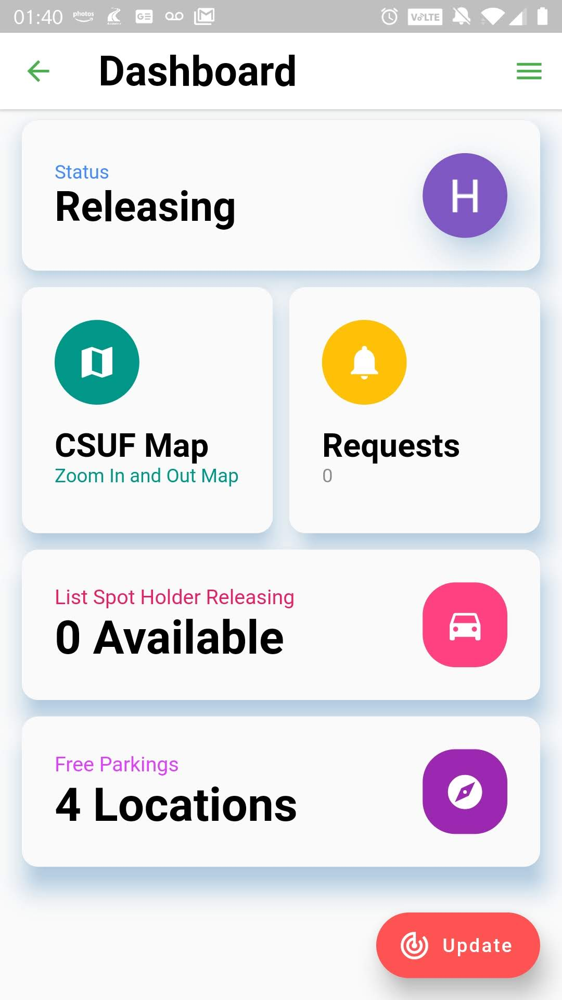
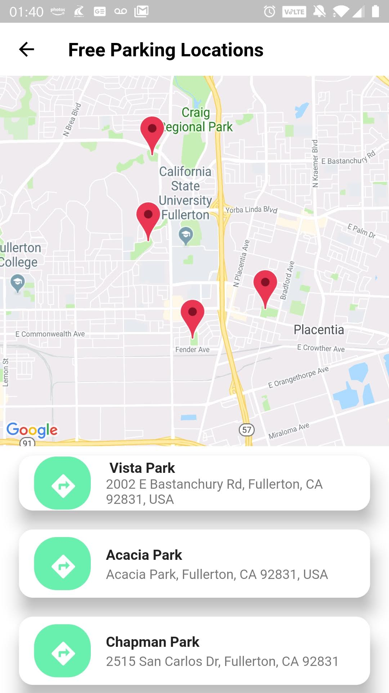
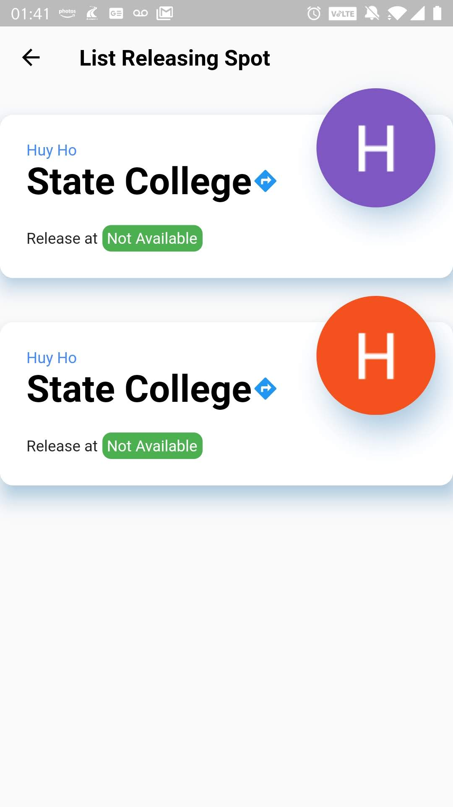
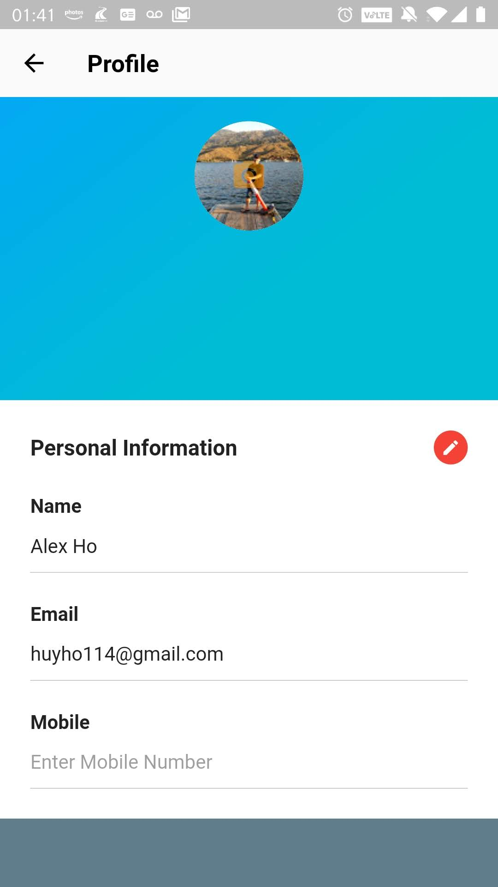
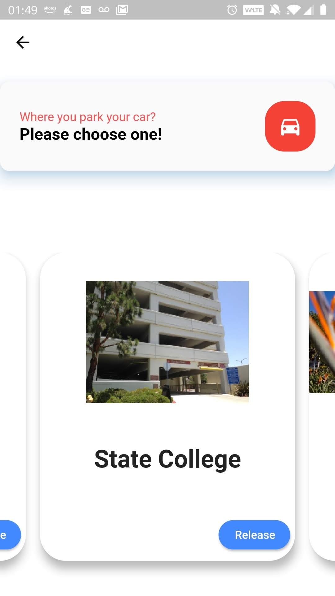

# CSUF Parking 

The application is about finding parking spot. Students who are leaving campus will announce and give parking spots to other students who are looking for a parking spot. This allows for fast, easy, and reliable parking spot transfers. The incentive to use this app is students will no longer have to wander around campus in search of a parking spot. If we have a large user base we can reliably and quickly find our users parking spots within at most minutes from the time they send a request to the time of fulfillment.

## Purpose

The chaos that occurs in the parking lots every morning of every weekday for the Cal State University of Fullerton (CSUF) community. There are students who have missed a class or even a quiz because of looking for a parking spot. A lot of students are not only stressed about their studies but they are also stressed about the commute which later on may lead to frustration. Furthermore, with the new construction zone at the old Lot E and staff parking, it takes a lot of space. The campus has addressed these issues by providing parking off campus along with its shuttle services, Waze Carpool, Zipcar, and Parking Assistant, but these solutions are not effective in solving the current problem. Given that CSUF continues to sell parking permits despite not having adequate parking spaces available, students are often left searching for extended periods of time. Time is mainly an overlooked aspect of the current solutions that the university is providing. 

With this in mind, we propose creating a mobile application that aims to alleviate the problems in finding parking spaces with adequate timing. The CSUF Parking app would function as a real-time database where students can announce via the app that they are leaving. Students that are searching for parking can then communicate with the departing student and arrange for them to take their spot. The app would effectively lower the time students waste looking for parking by providing an interactive student community environment. 


## Installation

- [Get started with Flutter on Windows](https://medium.com/fnplus/setting-up-flutter-for-windows-ca2c5e643fdf)

- [Get started with Flutter on Linux Ubuntu](https://link.medium.com/wnUcqyGaUZ)

- [Get started with Flutter on Mac](https://medium.com/@sethladd/installing-flutter-on-a-mac-13a26340f80a)


## Code style

Follow effective dart style

[](https://dart.dev/guides/language/effective-dart/style)

## Demo and ScreenShots


  

  

 


## Code Example

main.dart with navigate routes

```dart
class MyApp extends StatelessWidget {
  // This widget is the root of your application.
  @override
  Widget build(BuildContext context) {
    return MaterialApp(
      debugShowCheckedModeBanner: false, // this removes the debug banner
      title: 'Parking App',
      theme: ThemeData(
        primarySwatch: Colors.blue,
      ),
      //initial application go to log in screen
      initialRoute: 'login_page',
      routes: {
        'login_page': (context)=>LoginPage(),
        'home_page': (context)=>HomePage(),

      },
    );
  }
}
```

## Features and Plugins

- [Flutter Material](https://material.io/)

- [Flutter Animation Control](https://flutter.dev/docs/development/ui/animations)

- [Firebase Authentication](https://pub.dev/packages/firebase_auth)

- [Cloud Firestore](https://pub.dev/packages/cloud_firestore)

- [Google Map Flutter](https://pub.dev/packages/google_maps_flutter)

- [Photo View](https://pub.dev/packages/photo_view)

- [Image Picker](https://pub.dev/packages/image_picker)

- [Share Preferences](https://pub.dev/packagesshared_preferences)

- [Google SignIn](https://pub.dev/packages/google_sign_in)


## Credits

[Alex Ho](https://github.com/hho114): front-end, back-end,research, maintenance, testing.

[Christopher Ta](https://github.com/Krunk-Juice): front-end, plan, document, design.

[Marco Chavez](https://github.com/mchvz93): front-end, back-end, testing, research.


## License

[MIT](https://choosealicense.com/licenses/mit/)

## Have Fun

Hey yo!!! Want my spot?


I am late again !!!!!!!

