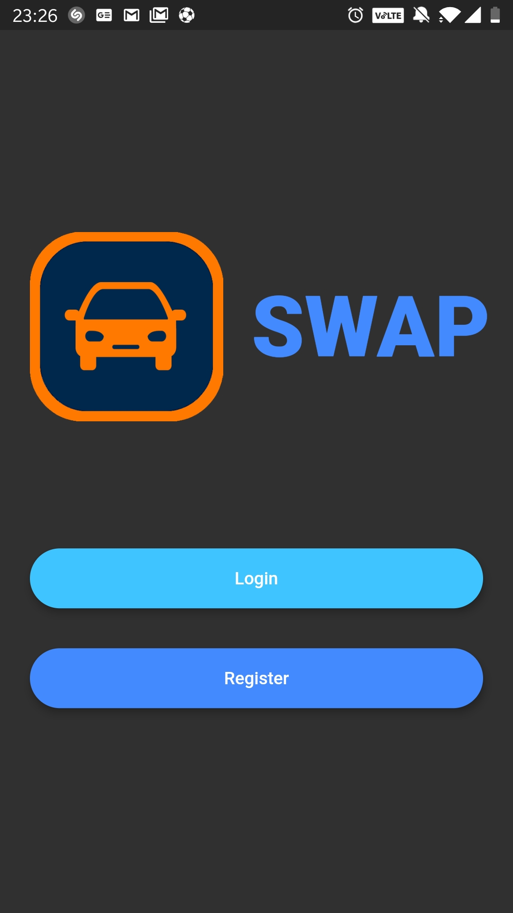
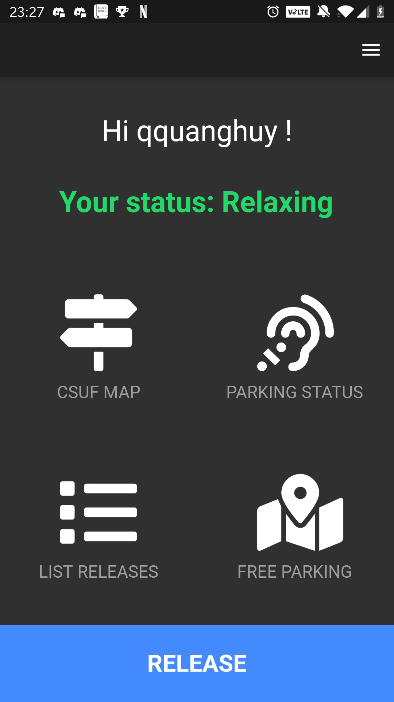
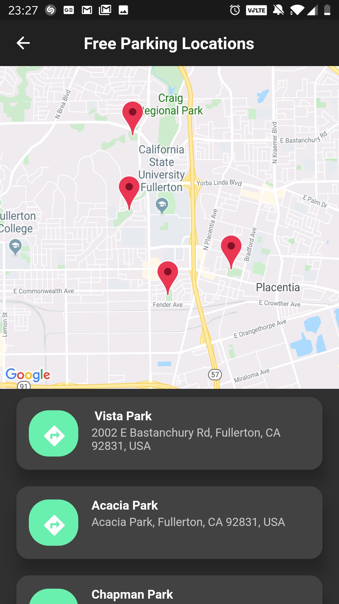
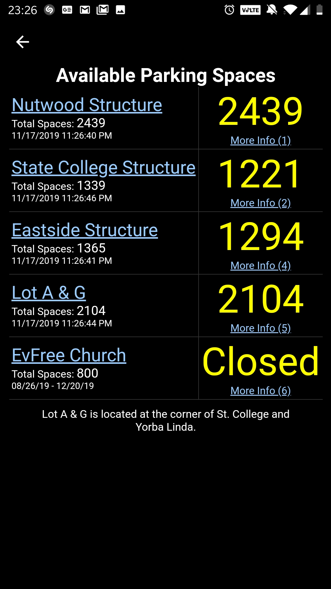

# CSUF SWAP

The application is about finding parking spot. Students who are leaving campus will announce and give parking spots to other students who are looking for a parking spot. This allows for fast, easy, and reliable parking spot transfers. The incentive to use this app is students will no longer have to wander around campus in search of a parking spot. If we have a large user base we can reliably and quickly find our users parking spots within at most minutes from the time they send a request to the time of fulfillment.

## Project Submission

- [All submit files in "doc" directory (doc/*)](doc)

- [All demo video files in "demo" directory (demo/*)](demo)

- [All code files in "lib" directory (lib/*)](lib)

## Releases APK Versions

- [APK Release (64bit)](doc/CSUF-SWAP-64bit-release.apk)
- [APK Release (32bit)](doc/CSUF-SWAP-32bit-release.apk)

## IDE Setup

- [Get started with Flutter on Windows](https://medium.com/fnplus/setting-up-flutter-for-windows-ca2c5e643fdf)

- [Get started with Flutter on Linux Ubuntu](https://link.medium.com/wnUcqyGaUZ)

- [Get started with Flutter on Mac](https://medium.com/@sethladd/installing-flutter-on-a-mac-13a26340f80a)

## Tips and Tricks

- Use [VS Code](https://code.visualstudio.com/) for light weight code editing

- [Useful extension for VS Code](https://medium.com/flutter-community/must-have-vs-code-extensions-for-working-with-flutter-e31a421b9c68)

- Quick create android emulator:

```

flutter emulator --create

flutter emulator --launch flutter_emulator

```

- Check if enough IDE for flutter:

```

flutter doctor

```

## To run project

Requires: Either emulator(IPhone/Android) or usb debug connected device  

```

flutter run

```

## Code style

Follow effective dart style

[](https://dart.dev/guides/language/effective-dart/style)

## ScreenShots

  

  

## Code Example

main.dart with navigate routes

```dart
class MyApp extends StatelessWidget {
  // This widget is the root of your application.
  @override
  Widget build(BuildContext context) {
    return MaterialApp(
      debugShowCheckedModeBanner: false, // this removes the debug banner
      title: 'Parking App',
      theme: ThemeData(
        primarySwatch: Colors.blue,
      ),
      //initial application go to log in screen
      initialRoute: 'login_page',
      routes: {
        'login_page': (context)=>LoginPage(),
        'home_page': (context)=>HomePage(),

      },
    );
  }
}
```

## Packages and Plugins

- [Flutter Animation Control](https://flutter.dev/docs/development/ui/animations)

- [Firebase Authentication](https://pub.dev/packages/firebase_auth)

- [Cloud Firestore](https://pub.dev/packages/cloud_firestore)

- [Google Map Flutter](https://pub.dev/packages/google_maps_flutter)

- [Photo View](https://pub.dev/packages/photo_view)

- [Image Picker](https://pub.dev/packages/image_picker)

- [Share Preferences](https://pub.dev/packagesshared_preferences)

- [Dynamic Themes](https://pub.dev/packages/dynamic_theme)

- [Animated Text Kit](https://pub.dev/packages/animated_text_kit)

## Credits

[Alex Ho](https://github.com/hho114): front-end, back-end,research, maintenance, testing.

[Christopher Ta](https://github.com/Krunk-Juice): front-end, plan, document, design.

[Marco Chavez](https://github.com/mchvz93): front-end, back-end, testing, research.

## License

[MIT](https://choosealicense.com/licenses/mit/)

## Have Fun

Hey yo!!! Want my spot?


I am late again !!!!!!!

